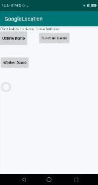

### HayLocation
----

This is a textView to ask locate permission, check GPS on and present location by itself




### Use
----

Add Permission on AndroidManifest first
```
<manifest xmlns:android="http://schemas.android.com/apk/res/android">

    <uses-permission android:name="android.permission.ACCESS_FINE_LOCATION" />
    <uses-permission android:name="android.permission.ACCESS_COARSE_LOCATION"/>
    <uses-permission android:name="android.permission.INTERNET"/>
    
</manifest>    
```


Declare this view on xml! That's it
```
<com.dendrocyte.haylocation.module.customView.UtilBtn
        android:id="@+id/btn_cuslocation"
        android:layout_width="100dp"
        android:layout_height="50dp"        
        />
```

| attr                        | description                                                               | values                                                                                    |
|:----------------------------|:--------------------------------------------------------------------------|:------------------------------------------------------------------------------------------|
| app:locationMethod          | get location by Location / Address <br/> once / frequently                | getLastLocation (default)<br/>getLastAddress<br/>GetLocationUpdates<br/>GetAddressUpdates |
| app:intervalMillis          | configure LocationRequest (must-have)                                     | [0, Long.MAX_VALUE], 60 * 60 * 1000 (default)                                             |
| app:maxUpdates              | configure LocationRequest about maximum times to update location          | [1, Long.MAX_VALUE], Integer.MAX_VALUE (default)                                          |
| app:maxUpdateAgeMillis      | configure LocationRequest                                                 | [0, Long.MAX_VALUE], -1L (default)                                                        |
| app:minUpdateIntervalMillis | configure LocationRequest about minimum interval(ms) to update            | [0, Long.MAX_VALUE], 10 * 60 * 1000 (default)                                             |
| app:minUpdateDistanceMeters | configure LocationRequest about minimum distance(m) to update             | [0, Float.MAX_VALUE], 0f (default)                                                        |
| app:waitForAccurateLocation | configure LocationRequest                                                 | true, false (default)                                                                     |
| app:granularity             | configure LocationRequest about location range                            | permissionLevel (default)<br/>coarse<br/>fine                                             |
| app:priority                | configure LocationRequest about location accuracy                         | highAccuracy (default)<br/>balancedPowerAccuracy<br/>lowPowerAccuracy                     |                                               |
| app:durationMillis          | configure LocationRequest                                                 | Long.MAX_VALUE(default)                                                                   |
| app:maxUpdateDelayMillis    | configure LocationRequest                                                 | 0L (default)                                                                              |
| app:alwaysShow              | configure LocationSettingRequest                                          | true, false (default)                                                                     |

